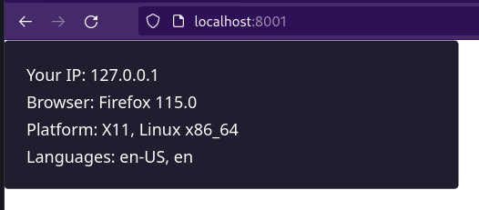
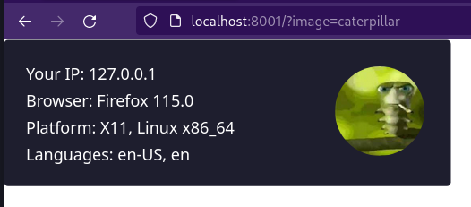
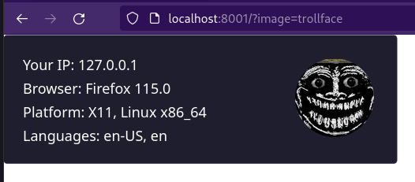

# Sneaky img

A normal svg, which you can use on your site or in markdown, but it's generated dynamically and shows user's IP, browser, platform and installed languages on the system.

> **Note**  
> This doesn't work on GitHub and GitLab.com, because they proxy images from README files

## Installation

Just run the executable on some server.

## Usage

Just embed it in your markdown, as follows:

    

Additionally, you can append the url with `?image=caterpillar` or `?image=trollface` 

## Building

In order to compile it, you have to have [Crystal](https://crystal-lang.org/) installed. Then clone this repository and run `shards build --production`. The binary will be in a `bin` folder.

## Contributing

1. Fork it (<https://github.com/rafal06/sneaky-img/fork>)
2. Create your feature branch (`git checkout -b my-new-feature`)
3. Commit your changes (`git commit -am 'Add some feature'`)
4. Push to the branch (`git push origin my-new-feature`)
5. Create a new Pull Request
